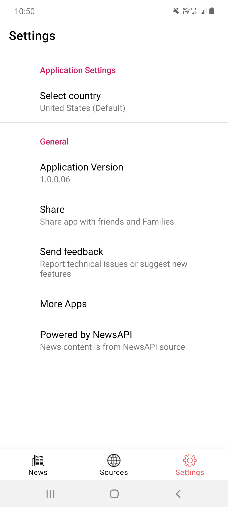

# News Today
News Today application is a simple application built using [Modern Android Development](https://developer.android.com/modern-android-development) patterns.

This app uses [NewsAPI](https://newsapi.org/) to fetch news headlines from the API.

# Built With
  - [MVVM Architecture](https://en.wikipedia.org/wiki/Model%E2%80%93view%E2%80%93viewmodel)
  - [Kotlin](https://kotlinlang.org/)
  - [Architecture Components(LiveData, View Model, Room DB)](https://developer.android.com/topic/libraries/architecture)
  - [Retrofit2](https://square.github.io/retrofit/)
  - [Gson](https://github.com/google/gson)
  - [Glide](https://github.com/bumptech/glide)
  - [Material Design Components](https://material.io/components)

# Screenshots
    
